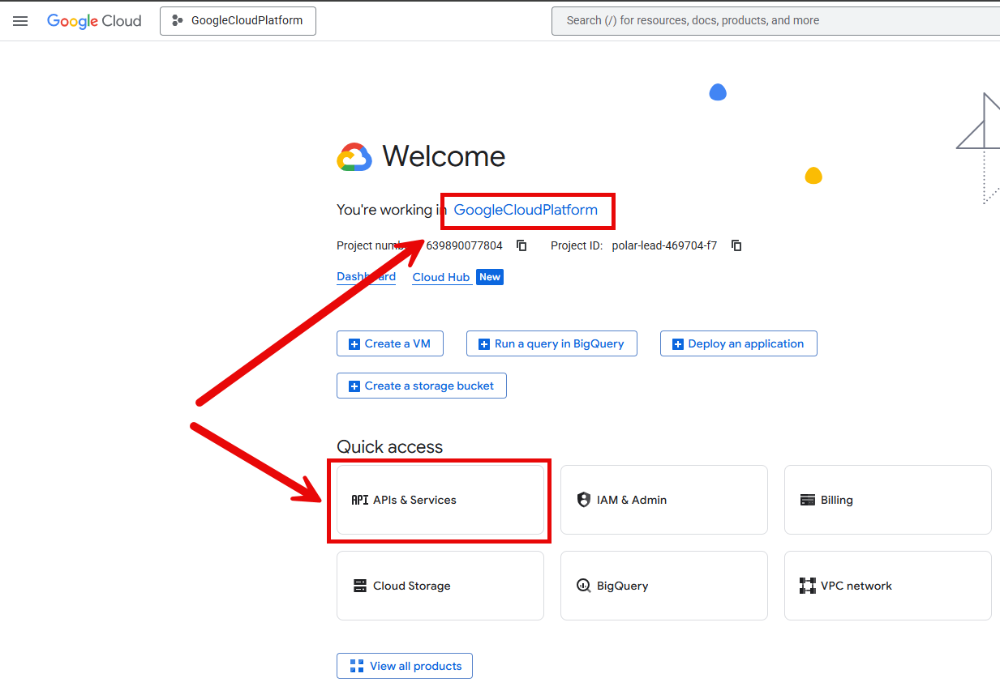
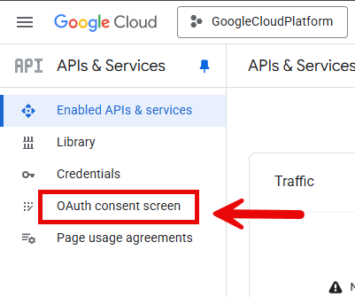
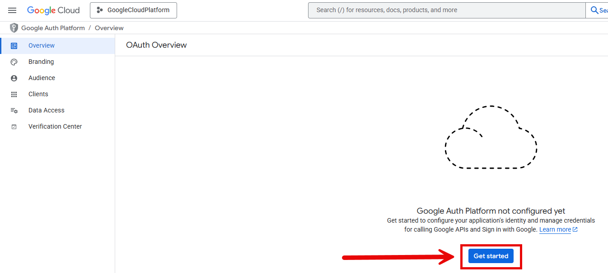
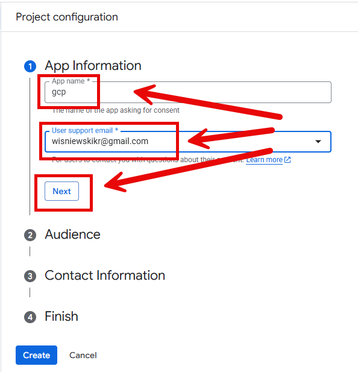
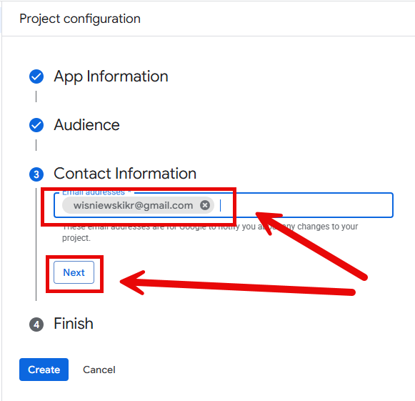
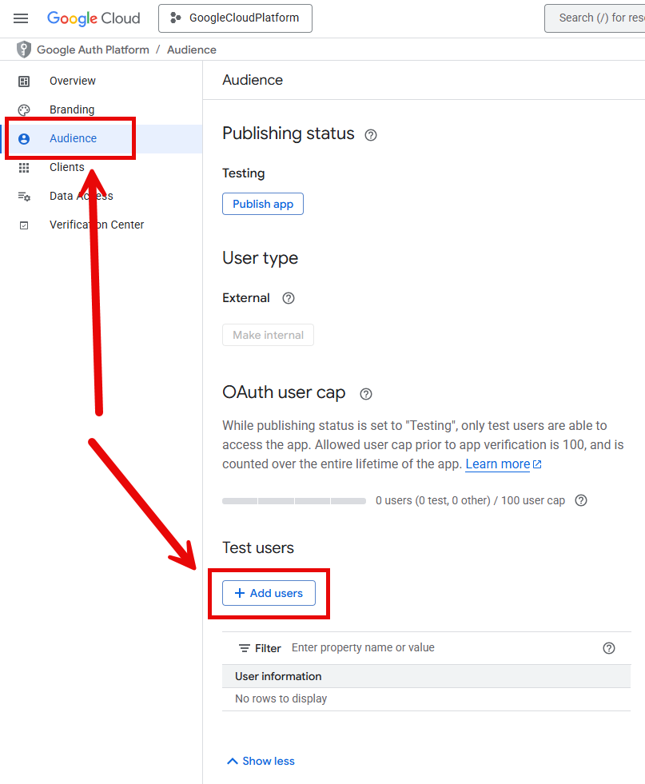
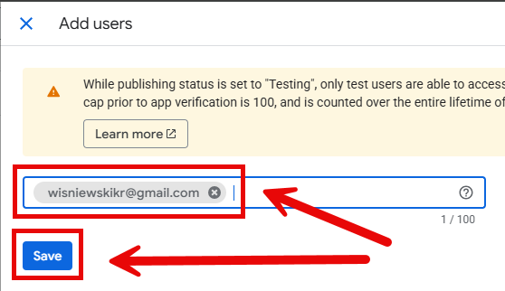
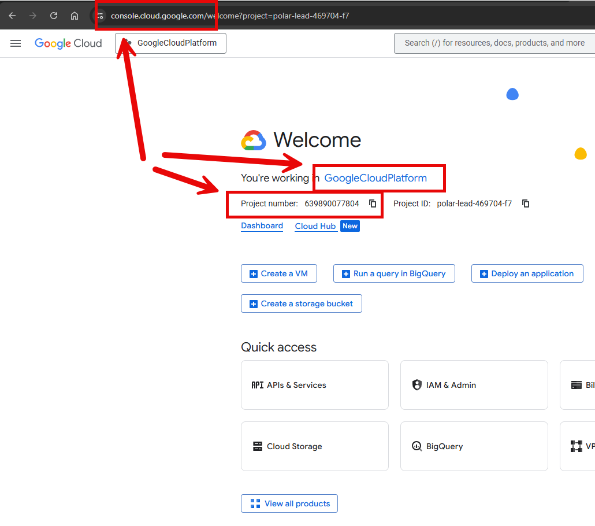
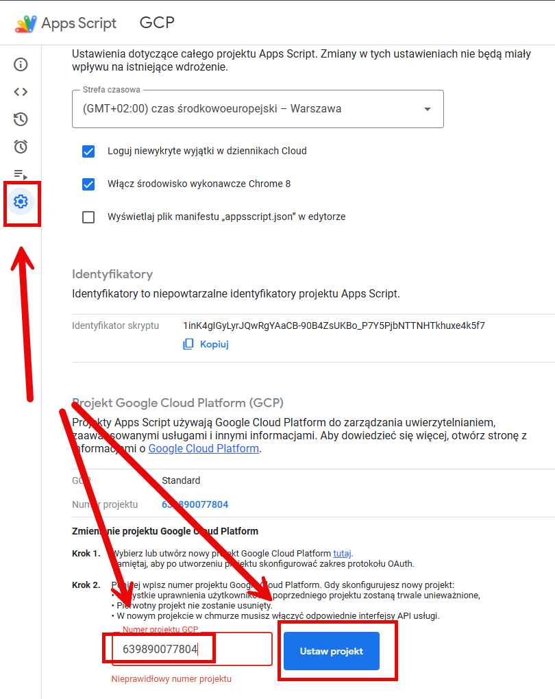

ALERT
=====

GSHEET URL
----------

* **Gsheet URL**: https://docs.google.com/spreadsheets/d/1FUYbaP5_YCzzGh4NwazRFNIOlTxA_DqToteGA0zANIg/edit?usp=sharing

DESCRIPTION
-----------

The goal this project is to present how to connect application in **Google Apps Script** with **Google Cloud Platform (GCP)**.

Useful links:
* https://console.cloud.google.com/
* https://groups.google.com/g/groups-groupsapp
* https://myaccount.google.com/connections

CONFIGURATION - CREATE GCP PROJECT
----------------------------------

CONFIGURATION - CREATE GCP PROJECT CONSENT
------------------------------------------

CONFIGURATION - CREATE GCP PROJECT CREDENTIALS
----------------------------------------------

CONFIGURATION - CONNECT GAS PROJECT WITH GCP PROJECT
----------------------------------------------------

