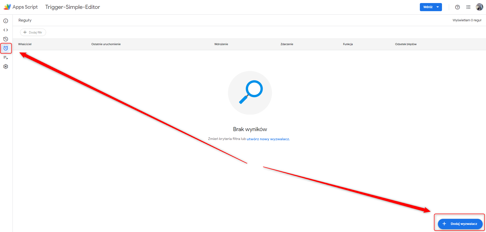
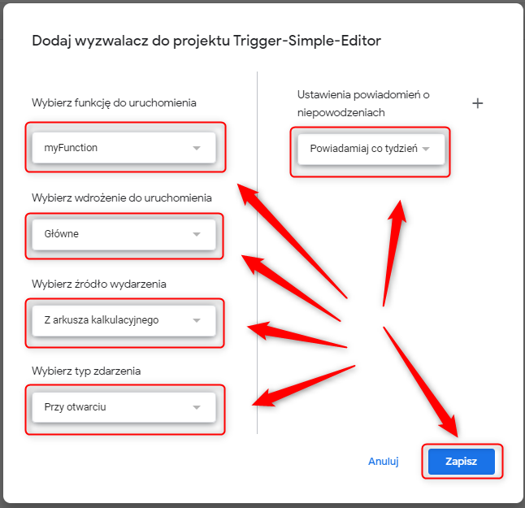
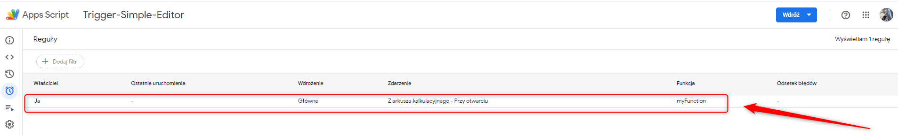

URL
---

##### URL
https://docs.google.com/spreadsheets/d/1jb7SA_VgIrLovXhxDm_dq7Gru83tf8ZfXIXBo49zvzw/edit?usp=sharing

DESCRIPTION
-----------

##### Goal
The goal of this project is to show how to create Simple Trigger which is defined in a code.

##### Details
When user refreshes Gsheet then Simple Trigger defined in a code should be started.

##### Result 
After refresh Gsheet a dialog with message should be displayed by Simple Trigger.

TRIGGER CONFIGURATION
---------------------

